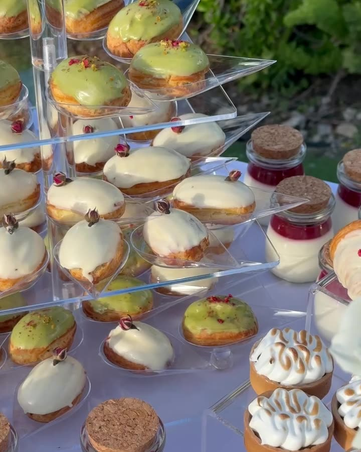

# ELART — сайт

Статичный сайт: HTML + CSS + JS, без сборки и фреймворков.

## Структура

```
elart-website/
├── index.html        главная (свадьбы, праздники, chef's table, о нас, FAQ, заявка)
├── yacht.html        страница ELART Yacht
├── css/style.css     общий стиль (цвета, шрифты, все блоки)
├── css/yacht.css     стили только для страницы яхт
├── js/main.js        меню, шапка, формы
├── images/           фото, видео, favicon
└── robots.txt, sitemap.xml
```

## Как открыть в VS Code

1. VS Code → File → Open Folder → выберите `Documents/elart-website`.
2. Установите расширение **Live Server**: VS Code сам предложит его справа внизу.
3. Правый клик по `index.html` → **Open with Live Server**. Сайт откроется в браузере
   и будет обновляться при каждом сохранении файла.

## Что заменить

Найдите в файлах (Ctrl+Shift+F) квадратные скобки `[` и слово `TODO`:

- телефон, email, Instagram;
- минимум заказа, депозит, условия дегустации, цены на яхты;
- отзывы и площадки — только реальные;
- домен `elartcatering.com` в `<head>`, `robots.txt`, `sitemap.xml`.

### Как поставить фото вместо бежевых плашек

Было:
```html
<div class="ph b zoom"><span class="tag">Wedding reception</span></div>
```
Стало:
```html

```

Видео на первом экране:
```html
<video class="ph" src="images/hero.mp4" poster="images/hero.jpg" autoplay muted loop playsinline></video>
```

### Цвета и шрифты

В начале `css/style.css`, блок `:root`:
`--ivory` фон, `--cream` второй фон, `--ink` текст, `--serif` заголовки (Bodoni Moda), `--sans` текст (Manrope).

## Форма заявки → GoHighLevel

Сейчас форма только показывает «Thank you». Варианты подключения:

1. **Проще всего:** в GoHighLevel создайте форму (Sites → Forms), скопируйте embed-код
   и вставьте его вместо `<form id="form">…</form>` в `index.html` и `yacht.html`.
2. **С сохранением дизайна:** создайте Inbound Webhook в GHL Workflows и в `js/main.js`
   (место отмечено `TODO`) отправляйте поля через `fetch(webhookUrl, { method: 'POST', body: … })`.

Для SMS нужны чекбокс согласия (уже есть) и регистрация A2P 10DLC в GHL.

## Публикация (бесплатно)

- **Netlify:** app.netlify.com → Add new site → Deploy manually → перетащите папку `elart-website`.
- **Vercel / GitHub Pages** — тоже подходят, сборка не нужна.

Потом подключите свой домен в настройках хостинга.
